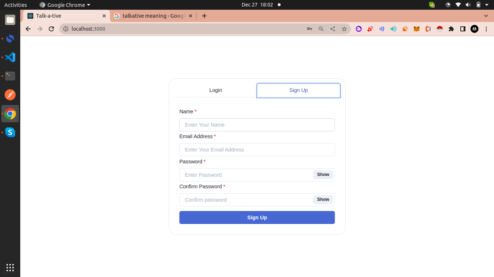
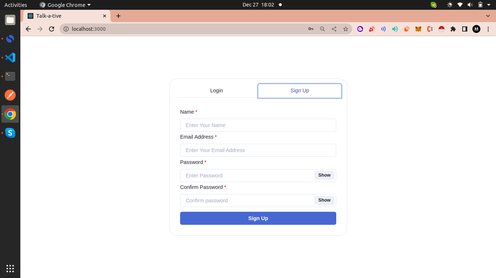
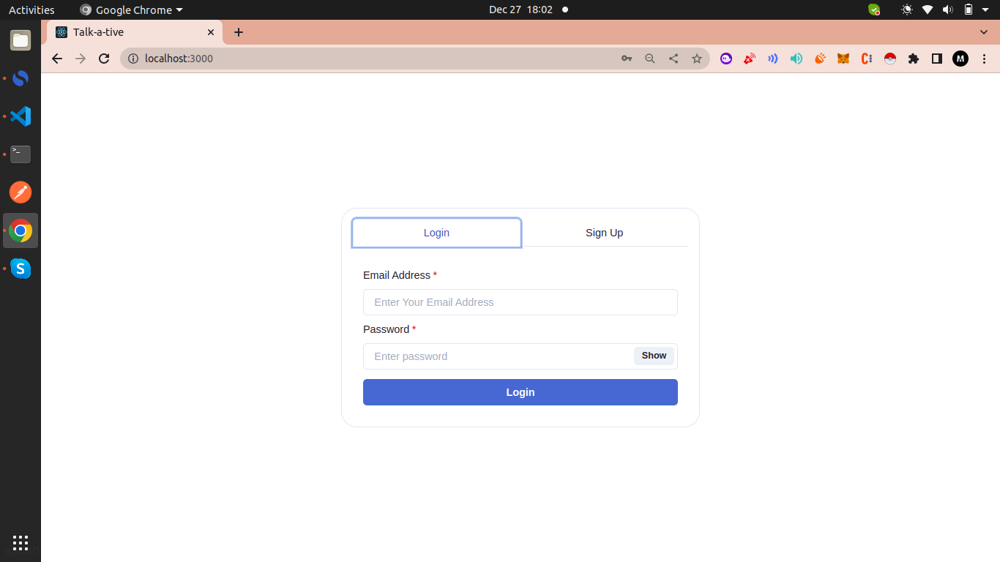
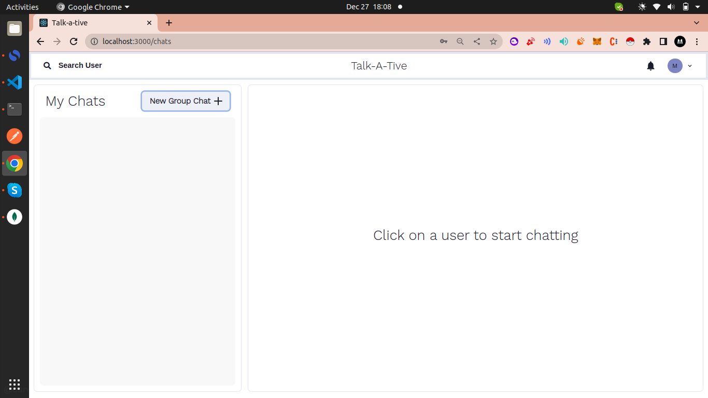
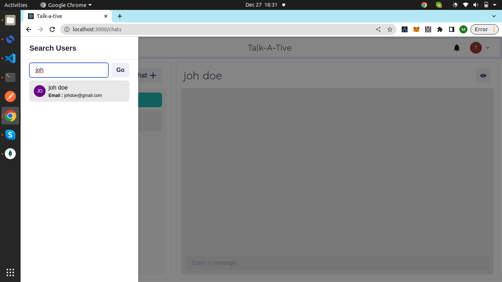
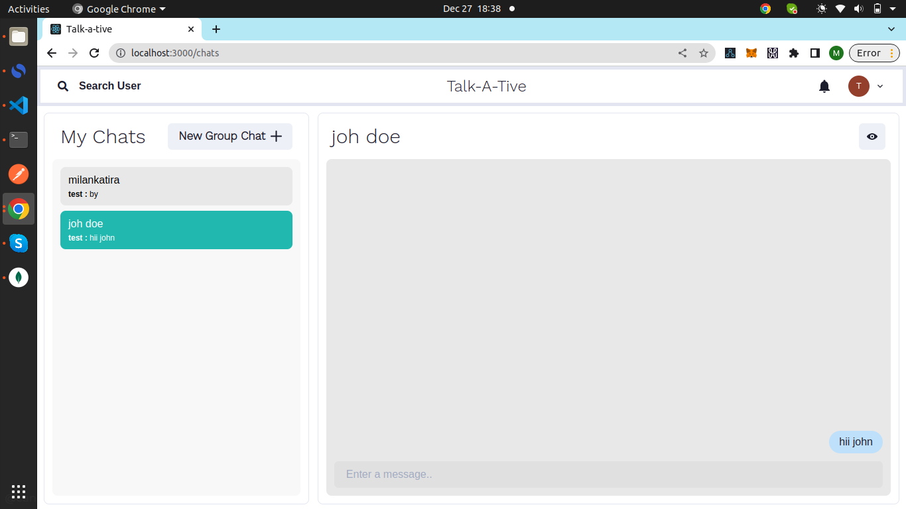
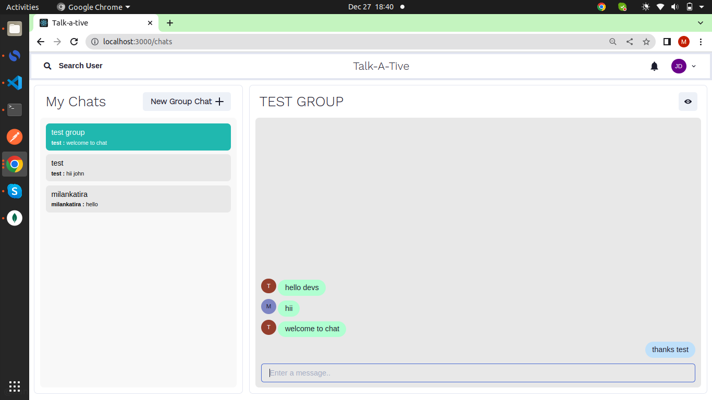

# Realtime chat application MERN stack

## technology

#### frontend
 - reactjs
 - chakra ui
 - socket io
 - javascript

#### backend
 - node js
 - express js
 - socket io
 - typescript
 - mongodb


## to run this project

#### for backend 

#### make sure you have MongoDB installed locally and working fine I also added .env because we don't have any secret so.

##### got to Api folder and change .env

##### install node module
```bash
yarn 
```

##### run project
```bash
yarn dev
```

##### generate production build
```bash
yarn build
```

##### to format code
```bash
yarn format
```


#### for frontend 

##### got to frontend folder and change .env

##### install node module
```bash
yarn 
```

##### run project
```bash
yarn start
```


### optimization scope and future plan
- Take add static string value from constant folder
- Take all static status codes from the constant folder
- Use cookies to verify the user
- Add type guarding for error
- Write perfect error code for different error
- Write test cases for api and frontend 
- write snapshot changes for detect component level change
- use tailwind css for fast and pixel perfect desining
- Create 100% test coverage


### preview









